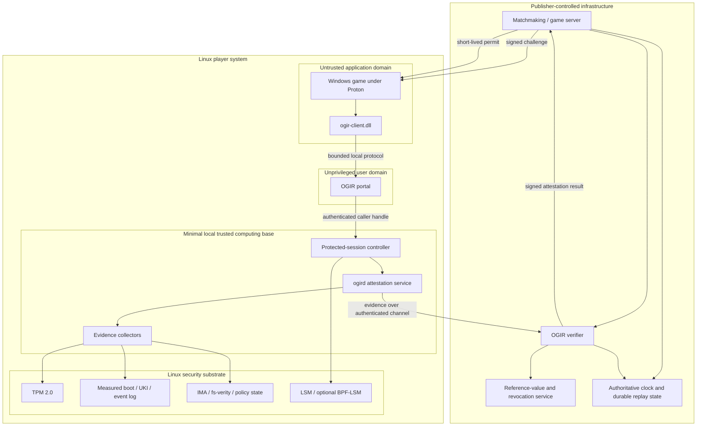
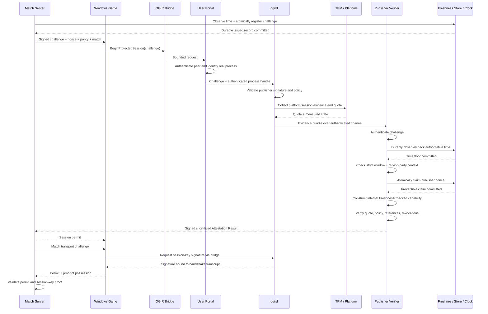

# OGIR Architecture

## 1. Purpose

Open Game Integrity Runtime gives a publisher a Linux-native way to request a narrowly defined game-session integrity policy from a Windows game running through Proton, receive fresh evidence rooted in an accepted platform, and make a server-side authorization decision.

OGIR is an integrity substrate, not a complete anti-cheat product. Publishers still need server-authoritative game logic, exploit prevention, behavioral detection, account security, moderation, and incident response.

## 2. Goals

- Keep the Windows game binary viable under stock Proton.
- Avoid translating arbitrary Windows kernel drivers.
- Keep the game client outside the trust boundary.
- Root freshness and platform evidence in a TPM-backed attestation flow.
- Bind evidence to the exact publisher, game, build, policy, match, runtime, and session key.
- Apply any runtime restrictions only to the protected game session.
- Minimize disclosed information and prevent arbitrary publisher queries.
- Let publishers self-host the verifier and define accepted policies.
- Make every security claim executable as a conformance or adversarial test.

## 3. Non-goals

- Proving that no cheat can ever exist.
- Emulating Microsoft Secure Kernel, VBS, HVCI, or a Windows kernel-driver trust chain.
- Running or translating arbitrary `.sys` drivers.
- Exposing unrestricted physical TPM commands to games.
- Scanning unrelated processes, files, browser activity, or communications.
- Supporting every distribution, custom kernel, firmware, and Proton build in the first profile.
- Automatically banning a player after an integrity failure.
- Replacing server-side anti-cheat or server-authoritative design.

## 4. Architectural separation

OGIR has two separate planes.

### 4.1 Attestation and protected-session plane

This is the primary project.

```text
Publisher challenge
    -> Proton-facing bridge
    -> local caller authentication
    -> protected-session establishment
    -> evidence collection and TPM quote
    -> publisher verifier
    -> short-lived session permit
```

The physical TPM is reachable only through narrow high-level operations controlled by the local agent.

### 4.2 Windows TPM compatibility plane

This is a later and separate Wine workstream.

```text
Windows TBS/CNG-compatible call
    -> Wine built-in DLL / Unixlib
    -> isolated per-prefix virtual TPM
```

The virtual TPM provides compatibility state, not proof of the physical host or competitive integrity. Raw TBS command forwarding must terminate at the virtual TPM, never at the physical TPM.

## 5. Trust domains



### 5.1 Untrusted Windows game and bridge

Responsibilities:

- receive a publisher challenge;
- call the narrow OGIR API;
- return opaque status and a publisher-signed permit to the game;
- prove possession of the attested session key during matchmaking.

It must not:

- decide that the machine is trusted;
- choose PCRs or physical TPM commands;
- identify its own process authoritatively;
- request arbitrary host information;
- install or replace a privileged daemon;
- grant itself a permit.

### 5.2 Unprivileged portal

Responsibilities:

- accept bounded local requests;
- authenticate peer credentials;
- associate Wine/Proton-side requests with the real Linux process;
- pass process handles and validated challenge material to the privileged service;
- shield the privileged service from Windows ABI and high-volume untrusted parsing.

The portal must run without system privileges.

### 5.3 Protected-session controller

Responsibilities:

- create a dedicated session identity and cgroup;
- verify that the game process belongs to the expected launch context;
- establish the selected session policy;
- prevent policy mutation after activation;
- report enforcement state to the attestation service;
- remove all session-scoped controls at termination.

This component starts with observation and process binding. Enforcement is added only after the attestation MVP is correct.

### 5.4 Attestation service (`ogird`)

Responsibilities:

- validate publisher challenge signatures and policy identifiers;
- coordinate the TPM backend and evidence collectors;
- independently derive claims rather than signing caller-supplied statements;
- create publisher-scoped attestation identities;
- create a match-specific ephemeral session key;
- bind the challenge and session claims into TPM qualifying data;
- transmit evidence directly to the verifier;
- erase short-lived sensitive state at session end.

The service must expose no arbitrary file, process, kernel, BPF, TPM, or command-execution API.

### 5.5 Publisher verifier

Responsibilities:

- durably check/advance publisher-authoritative time before evaluating a
  window, even when that window will be rejected;
- require strict challenge validity at `issued_at <= now < expires_at` with no
  acceptance leeway;
- atomically claim `(PublisherId, Nonce)` single-use state after exact context
  matching and before expensive appraisal;
- preserve issued/consumed replay records and the time high-water mark across
  restart, and fail closed when that state is unavailable or rolled back;
- verify TPM quote and attestation-key enrollment;
- validate measured-boot and runtime evidence against accepted policy;
- validate game, build, runtime, match, account scope, and session-key binding;
- check agent, policy, platform, and verifier revocations;
- produce a signed, short-lived Attestation Result or permit;
- provide structured reasons without treating failure as proof of cheating.

The verifier is publisher-controlled and self-hostable.

### 5.6 Reference-value service

Responsibilities:

- publish signed accepted platform profiles;
- publish accepted agent, runtime, and game manifests;
- publish revocations and minimum protocol versions;
- maintain transparency and change history;
- separate reference submission from production approval.

This service is not part of the first proof. The MVP can use a small static signed policy fixture.

## 6. Core data flow



## 7. Protocol objects

The initial protocol model should define these objects before choosing a serializer:

### Identifier profile and trust sources

OGIR's protocol identifiers are typed before they enter the pure model. Text
identifiers use the canonical grammar
`[a-z0-9]+(?:[.-][a-z0-9]+)*` and contain at most 128 bytes. Uppercase,
Unicode, whitespace, control bytes, `_`, `:`, `/`, `\`, edge separators, and
adjacent separators are rejected. Constructors do not trim, case-fold, or
normalize input. Internationalized display names, storefront IDs, and
publisher-specific account formats require explicit mapping outside this
canonical identifier layer.

This profile follows the Rust API Guidelines for
[validated newtypes](https://rust-lang.github.io/api-guidelines/dependability.html#functions-validate-their-arguments-c-validate)
and [static type distinctions](https://rust-lang.github.io/api-guidelines/type-safety.html#newtypes-provide-static-distinctions-c-newtype).
[Unicode UTS #39](https://www.unicode.org/reports/tr39/#Identifier_Characters)
permits applications to define profiles narrower than its allowed character
set. The [UTR #36 status page](https://www.unicode.org/reports/tr36/) marks that
older report as stabilized and partly superseded; OGIR therefore does not claim
Unicode normalization or confusable handling for protocol identifiers.

| Field or type | Source | Authority |
| --- | --- | --- |
| Challenge publisher, game, build, account, match, policy, and policy version | Publisher challenge | Untrusted until publisher authentication succeeds and every value matches independently supplied relying-party context. |
| `ExpectedContext` identifiers and policy version | Publisher relying party or game server | Authoritative input for exact challenge binding; never copied from client evidence. |
| `SessionId` | Trusted local portal/agent | Authoritative only for the local protected-session lifecycle; never accepted from the game process. |
| `EvidenceProfile` | Selected attestation backend and evidence envelope | A typed profile claim; verifier support policy decides whether the profile is acceptable. |

`PublisherId`, `GameId`, `BuildId`, `AccountScope`, `MatchId`, `PolicyId`, and
`SessionId` redact their values from Rust `Debug` output. `PolicyVersion`,
`UnixTime`, `ChallengeWindow`, `PublisherChallenge`, `ExpectedContext`, and
`VerificationRequest` likewise redact complete authorization bindings and
timing. Trusted verification/storage code obtains needed values only through
explicit accessors; those accessors are functional interfaces, not approved
diagnostic sinks.

### Challenge freshness authority

The publisher challenge issuer generates the nonce, selects the validated
window under explicit policy, and durably registers the issued record before
signing or returning the challenge. The publisher verifier supplies the only
authoritative evaluation time. Game, bridge, attester, and local-client clocks
or nonce caches are untrusted.

Every authoritative time observation durably checks/advances the persisted
floor before strict window evaluation; later window rejection does not erase a
future observation. `ChallengeWindow` is a validated half-open interval
`[issued_at, expires_at)` with zero acceptance leeway. Replay identity is
exactly `(PublisherId, Nonce)`; game, build, account, match, policy, and policy
version remain stored binding fields. After challenge authentication and exact
relying-party context comparison, one atomic store operation rechecks the
persisted time floor, window, binding, and issued state before irreversibly
changing it to consumed. Only that ordered crate-internal verifier path creates
`FreshnessChecked`; public raw claim consumes state but yields no capability.
Appraisal failure never releases the claim.

Issued and consumed records plus the verifier-time high-water mark survive
restart. Records are GC-eligible only when the time floor reaches expiry.
Per-publisher issuance events are GC-eligible when their configured enforcement
window ends. The reference adapter's reopen handles name the same authoritative
durable state generation rather than copying it, so a successful purge removes
data from every such handle. Exported backups require a separate finite
retention, deletion, and anti-rollback design before production use.
Rollback, missing/corrupt/unavailable state, or exhausted explicit
lifetime/capacity/account/rate limits makes protected mode unavailable; no
stateless fallback or unexpired-record eviction is permitted.

Identifier/time leaves plus challenge, expected-context, request, replay-key,
binding, registration, guard, store, and durable-state `Debug` implementations
emit only redaction markers. Publisher, game, build, account, match, policy,
policy version, nonce, and challenge-window timestamps never appear through
those diagnostic surfaces. Explicit field access remains necessary inside the
trusted core and must not be copied into diagnostics.
[ADR-0005](adr/0005-verifier-authoritative-challenge-freshness.md) records the
complete decision and deferred production-adapter obligations.

#### Verifier appraisal-flow authority

One `VerifierFlow` owns one exact request while active. Seven opaque,
non-cloneable gate capabilities advance one private checked graph. Every
capability carries one private `Arc` allocation identity plus the redacted
replay registration; `Arc::ptr_eq` rejects a capability from an equal but
distinct flow. Phase and binding checks precede mutation.

Only `PolicySatisfied -> Verified` emits one non-cloneable
`VerifiedAttestation`. `Decision`, `ReasonCode`, and `VerificationOutcome` are
reporting views and cannot substitute for that capability. Restricted success
is a separately selected and satisfied relying-party policy, never fallback
after full-policy failure.

The capability currently carries only the attempt binding and allowed class.
It is process-local, nonserializable, and not restart-durable. Future result
work must add typed verified claims under the same binding and consume the
capability; raw request fields cannot be refilled into an unrelated signed
result. Active request ownership ends at every terminal without claiming
secure memory erasure. M1-010 adds no signature, evidence, identity,
session-key, revocation, policy, result-signing, permit, network, or persistence
adapter.

### 7.1 PublisherChallenge

Required fields:

```text
protocol version
publisher identifier
game identifier
game build identifier
account-scoped identifier
match/session identifier
policy identifier and version
fresh random nonce
issued-at and expiry
publisher verifier identity
ephemeral server channel-binding material
publisher signature
```

### 7.2 LocalSessionDescriptor

Derived locally, never trusted from the game:

```text
Linux process handle and start time
UID
cgroup/session identity
Wine server and prefix identity
Proton/runtime manifest digest
game executable manifest digest
active protected-session policy digest
ephemeral session public key
```

#### Local session lifecycle authority

Trusted local adapters mint opaque completion capabilities only after their
operations succeed. Every capability is privately bound to one `SessionId`
and consumed once by the checked lifecycle transition that accepts it. The
pure state machine owns ordering, but stores no raw operation payload and
performs no I/O.

Renewal reuses the permit-received and activation gates:

```text
Active -> RenewalPending -> PermitReceived -> Active
```

Terminal cleanup status is orthogonal to lifecycle disposition. `Ended` and
`Invalidated` never reactivate; cleanup moves only from `Required` to
`Complete` after matching trusted acknowledgement. Production adapters and
actual cleanup I/O remain future work.

### 7.3 EvidenceBundle

Contains clearly separated evidence classes:

```text
hardware-certified evidence:
  TPM quote
  selected PCR values
  attestation key identity/certification
  qualifying-data binding

measured-platform evidence:
  boot-event log or profile proof
  UKI/kernel measurement claims
  Secure Boot and policy claims

trusted-agent-observed evidence:
  game/runtime manifests
  process/session binding
  enforcement-policy status
  runtime measurement commitment

metadata:
  protocol version
  evidence profile
  freshness and expiry
  privacy disclosure class
```

Claims must identify whether they are directly TPM-certified, reconstructed from measured logs, or observed by trusted software.

### 7.4 AttestationResult

The verifier returns a signed result rather than raw local truth:

```text
allow-ranked | allow-restricted | deny | unsupported | retry
publisher/game/match/account binding
accepted policy and profile
session public key
evidence digest
issued-at and expiry
structured reason codes
verifier identity and signature
```

### 7.5 Renewal

A renewal binds a fresh nonce to the existing session key and active policy. It must not silently relax requirements.

### 7.6 Revocation

Revocations may target:

- protocol versions;
- agent or bridge builds;
- platform profiles;
- policies;
- attestation identities;
- verifier keys;
- game or runtime manifests.

## 8. Wire format strategy

The project should align with the IETF RATS role model and define an OGIR profile for Entity Attestation Token claims. The likely wire family is deterministic CBOR with COSE protection and CDDL schemas, but the first implementation must not commit to a library before:

- canonical encoding behavior is verified;
- malformed and duplicate-key handling is specified;
- signature coverage is unambiguous;
- conformance vectors exist;
- at least two decoders can be differentially tested;
- maximum nesting, field, string, and total message sizes are fixed.

JSON may be used for human-readable fixtures, but must not become an ambiguous signed production format by accident.

## 9. Local IPC

The desired local transport is an authenticated Unix-domain channel with explicit framing and strict limits.

Requirements:

- obtain kernel-provided peer credentials;
- pass a process handle or pidfd rather than trusting a numeric PID;
- prevent PID-reuse and namespace confusion;
- enforce one request state machine per connection;
- set fixed maximum message sizes and timeouts;
- reject unknown critical fields;
- avoid parsing publisher policy in the Wine DLL;
- never pass raw pointers across the Windows/Unix boundary;
- rate-limit challenge and signing requests.

The exact socket type and Rust wrapper require an ADR after a prototype of peer credential and file-descriptor passing.

## 10. TPM architecture

Define an internal trait so the rest of OGIR does not depend directly on one TPM library:

```text
AttestationBackend
  create_or_load_publisher_scoped_ak()
  certify_attestation_identity()
  quote(selected_pcrs, qualifying_data)
  create_ephemeral_session_key()
  sign_session_transcript()
  destroy_ephemeral_state()
```

Rules:

- no raw physical-TPM command API is exposed to games;
- no Endorsement Key is returned to a game or publisher as a universal device ID;
- publisher-scoped Attestation Keys are preferred;
- TPM resource-manager limits and cancellation are handled;
- test, software-TPM, and hardware-TPM backends are visibly distinguished;
- the verifier must know the assurance class of the TPM source;
- TPM access is serialized or pooled deliberately rather than left to accidental concurrency.

A future implementation may evaluate the Rust `tss-esapi` wrapper behind this trait. That dependency must remain isolated because it links to the native TPM2 software stack.

## 11. Measured boot and runtime evidence

The first supported platform profile should be narrow and predictable, preferably one UKI-oriented distribution or test image.

Evidence adapters may include:

- UEFI measured-boot event log;
- systemd UKI/PCR 11 profile evidence;
- Secure Boot state and signing hierarchy;
- kernel command-line and boot-phase measurements;
- kernel lockdown and module-signing policy;
- IMA PCR and measurement log;
- fs-verity or immutable runtime manifests.

The verifier must replay or validate logs against TPM-certified PCR state. A valid PCR alone is not a semantic policy decision.

## 12. Protected-session evolution

### Level 0: observation only

- identify game process tree;
- derive cgroup/session identity;
- hash runtime manifests;
- no runtime restrictions.

### Level 1: same-user isolation

- block external debugger attachment and equivalent write paths;
- protect process-memory interfaces;
- reject unapproved attachment to the game session;
- preserve unrelated user activity.

### Level 2: hardened ranked profile

- enforce accepted modules and platform policy;
- restrict unapproved BPF/perf/uprobe attachment;
- require immutable or appraised game/runtime files;
- short renewal interval;
- invalidate on policy change.

### Level 3: console-like gaming profile

- tightly controlled signed image;
- fixed kernel/runtime/reference set;
- stronger device/IOMMU and administrator restrictions.

BPF-LSM is optional and must not be the first enforcement mechanism. Any BPF program must be small, measured, versioned, publicly reviewable, session-scoped, and GPL-compatible.

## 13. Privacy architecture

The protocol exposes a fixed claim vocabulary. A publisher cannot request arbitrary host queries.

Allowed claim style:

```text
accepted_boot_profile = true
module_signature_policy = enforced
protected_session_policy = ranked-v1
game_manifest = accepted
runtime_manifest = accepted
freshness = valid
```

Disallowed by design:

```text
complete process list
unrelated application names
home-directory enumeration
browser/chat activity
raw biometric data
raw TPM endorsement key
universal cross-publisher device identifier
arbitrary file reads
```

Every evidence profile must declare its disclosure class and retention expectations.

## 14. Failure semantics

The system distinguishes:

```text
ALLOW
ALLOW_RESTRICTED
DENY_POLICY
UNSUPPORTED_PLATFORM
ATTESTATION_UNAVAILABLE
TRANSIENT_ERROR
PROTOCOL_ERROR
REVOKED
REPLAY_DETECTED
PROTECTED_SESSION_LOST
```

Only the publisher decides gameplay behavior. OGIR reason codes must not claim that a player cheated unless separate evidence establishes that conclusion.

## 15. Deployment topology

### Experimental local topology

- sample verifier on localhost;
- software signing keys;
- optional software TPM for plumbing tests;
- no production trust claims.

### Pilot topology

- publisher-hosted verifier;
- dedicated test keys/HSM partition;
- one accepted Linux profile;
- invite-only test accounts;
- no automatic bans.

### Production topology

Requires independent audits, reproducible builds, signed provenance, compromise-resilient updates, formal incident response, public conformance tests, policy transparency, and an operational security reserve.
